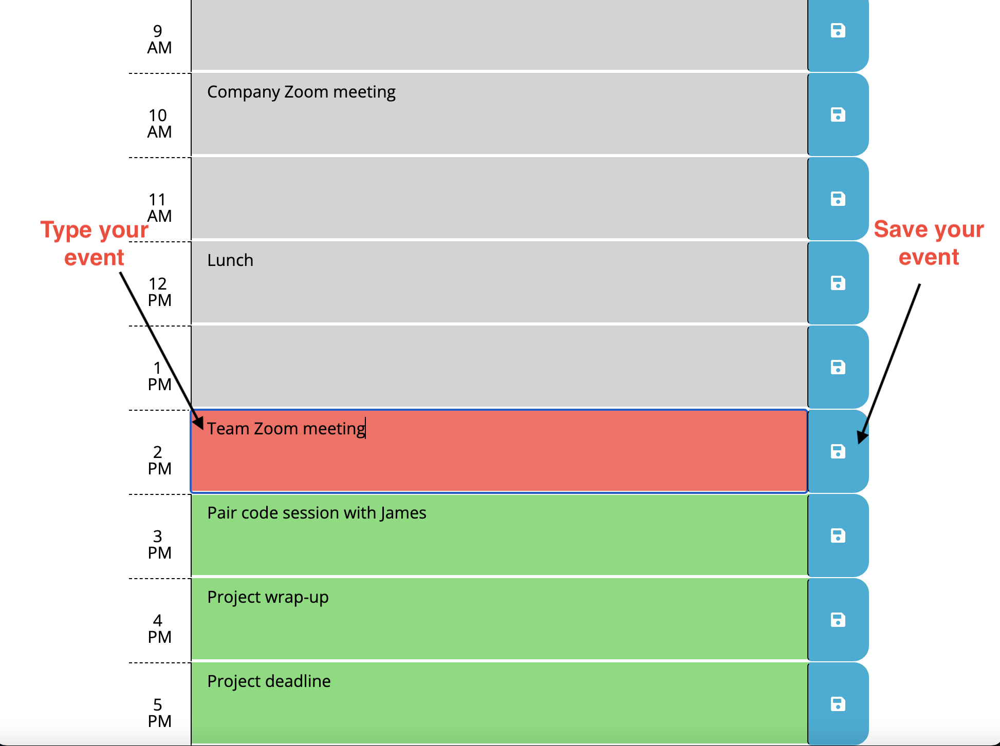

# ryans-word-day-scheduler

## Deployed Page

[Ryan's Workday Scheduler](https://rdalby2002.github.io/ryans-word-day-scheduler/)

## Description

An interactive 9-5 day planner to help professionals efficiently sort their busy days, making a heavy workload more manageable. The site includes 9 time blocks, with varying colors based on the user's current time of day; those being grey if the block's time has passed, red if the block matches the users current time, and green if the block's time is still upcoming. In addition, the planner includes individual save buttons for each time blocks that, on click, save that block's entry to the user's local storage, allowing for the entries to remain on the page upon reload. Through creating this site, I learned a lot about implementing third-party-APIs, and furthered my understanding of JavaScript. 

## Installation

N/A

## Usage

To use, click into any of the input boxes, type that hour's event/todo, then click that block's save button to save the entry to your local storage, as shown in this screenshot: 

## Credits

N/A

## License

MIT

---
